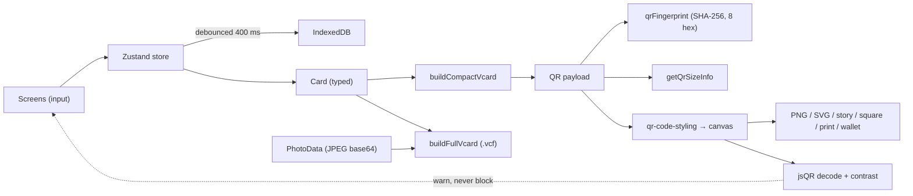

# Architecture

Vello is a single-route Next.js 16 App Router app with all product logic in pure modules under `src/lib` and `src/shared`, and all UI in `src/components`. Storage is IndexedDB. There are zero runtime network calls.

## Layers

```
┌──────────────────────────────────────────────────────────────────┐
│  src/app  (Next.js App Router shell)                              │
│  layout.tsx  — fonts (Fraunces, Instrument Sans, JetBrains Mono)  │
│              + ThemeProvider + Toaster                            │
│  page.tsx    — load store → AppShell or Onboarding                │
│  globals.css — design tokens (warm paper palette, light/dark)     │
└─────────────────────────────────────┬────────────────────────────┘
                                      │ renders
┌─────────────────────────────────────▼────────────────────────────┐
│  src/components/vello                                              │
│  view-context.tsx — client-side SPA view router (ViewProvider)    │
│  app-shell.tsx    — bottom tab bar (Card/Studio/Settings)         │
│  qr-preview.tsx   — live canvas QR with scan-check               │
│  screens/*        — one component per view                        │
└─────────────────────────────────────┬────────────────────────────┘
                                      │ uses
┌─────────────────────────────────────▼────────────────────────────┐
│  src/lib  (pure-ish logic; some browser APIs)                     │
│  normalizers.ts  — input validation & canonicalisation            │
│  vcard.ts        — compact + full vCard builders, fingerprint     │
│  qr.ts           — payload + byte size meter                      │
│  qr-render.ts    — qr-code-styling adapter, canvas render         │
│  scan-check.ts   — jsQR decode + WCAG contrast                    │
│  photo.ts        — centre-crop + JPEG re-encode                   │
│  export.ts       — PNG/SVG/.vcf/story/square/print/wallet         │
│  storage.ts      — IndexedDB adapter (idb-keyval), backup         │
│  style-presets.ts— 17 presets, swatches, fonts, "Surprise me"     │
│  store.ts        — Zustand store, single source of truth          │
│  haptics.ts, utils.ts                                             │
└─────────────────────────────────────┬────────────────────────────┘
                                      │ depends on
┌─────────────────────────────────────▼────────────────────────────┐
│  src/shared  (no dependencies; pure types & constants)             │
│  brand.ts   — name, tagline, appId, voice                          │
│  types.ts   — Card, QrStyle, Settings, PhotoData, CustomPreset     │
│  limits.ts  — field limits, QR thresholds, photo limits           │
└────────────────────────────────────────────────────────────────────┘
```

## Module boundaries

- **`src/shared` must not import anything from `src/lib`, `src/components`, or `src/app`.** It's the leaf layer.
- **`src/lib` may import from `src/shared` and from npm packages.** It must not import from `src/components` or `src/app`.
- **`src/components` may import from `src/lib`, `src/shared`, and from `src/components/ui`.** It must not import from `src/app` (Next.js shell).
- **`src/app` may import from anywhere.** It's the composition root.

This keeps the product portable: a Vite/Capacitor port would only need to replace `src/app` and the screen wiring.

## Data flow

The complete happy path, from user input to exported image:



In words:

1. The user enters data on a screen. `useVello().setCard(...)` updates the Zustand store.
2. After 400 ms (debounced), the store writes the card to IndexedDB via `saveCard`.
3. `qrFingerprint(getQrPayload(card))` is computed on save; if it differs from the previous fingerprint, the "QR changed" banner appears.
4. The `QrPreview` component re-renders on every style or card change. It calls `renderQrToCanvas`, which: builds the compact vCard, instantiates `qr-code-styling` with the mapped style options, appends it to a hidden div, copies its canvas onto our plate canvas, then overlays the centre element (initials/photo/emoji) and caption.
5. `scan-check.evaluateScan` runs `jsQR` over the canvas's `ImageData` and compares the decoded payload to the source. If they don't match or contrast is below 4.5, an amber/red message is shown.
6. On export, `src/lib/export.ts` calls `renderQrToCanvas` (or `qr-code-styling`'s `getRawData("svg")` for SVG) at the appropriate size, optionally draws additional text/backdrop layers, and returns a Blob. `shareOrDownload` uses `navigator.share({files})` when available, otherwise triggers a file download.

## Storage adapter

`src/lib/storage.ts` uses `idb-keyval` with a dedicated store:

```
IndexedDB database: vello-db
Object store:      vello-store
```

| Key | Value | Purpose |
| --- | --- | --- |
| `vello:card` | `{ schemaVersion, data: Card }` | The user's business card |
| `vello:card.bak` | `{ schemaVersion, data: Card }` | Previous version of the card, rotated on every save |
| `vello:style` | `{ schemaVersion, data: QrStyle }` | The active QR style |
| `vello:settings` | `{ schemaVersion, data: Settings }` | Theme, haptics, default ECC, persistence flag |
| `vello:photo` | `{ schemaVersion, data: PhotoData }` | 512 px JPEG + 256 px thumb (base64 data URLs) |
| `vello:presets` | `{ schemaVersion, data: CustomPreset[] }` | User-saved named presets |
| `vello:onboarded` | `boolean` | Whether the user finished onboarding |

Every record is wrapped in `{ schemaVersion: 1, data: ... }`. The `unwrap` helper compares the stored `schemaVersion` against `LIMITS.schemaVersion`; a future migration can branch on a mismatch.

`navigator.storage.persist()` is requested on first save; the persisted status is reflected in Settings. If the user clears site data or the browser evicts the storage, the `.bak` of the card is checked first; if absent, onboarding restarts.

## Build pipeline

- **Dev** (`bun run dev`): `next dev -p 3000`, output also teed to `dev.log`.
- **Build** (`bun run build`): `next build` produces a standalone server under `.next/standalone/`; the script then copies `.next/static` and `public/` into it.
- **Start** (`bun run start`): `NODE_ENV=production bun .next/standalone/server.js`, output teed to `server.log`.

The build does not make network calls for runtime data. `next/font/google` fetches font files at build time and inlines them under the app's origin.

## PWA / offline

- `public/manifest.webmanifest` declares the app name, icons, theme colours, and `display: standalone`.
- `public/icon.svg` is the maskable icon.
- Once installed, Vello works offline because all logic and assets are served from the same origin and the storage layer is IndexedDB.
- There is no service worker today. The PWA install relies on the browser's HTTP cache and the manifest; for guaranteed offline-first behaviour, a future work item is to add a `next-pwa` or hand-rolled service worker (see [BACKLOG.md](BACKLOG.md)).

## Privacy boundary

The architectural invariant is: **runtime code in `src/` makes zero network calls**. The `check:privacy` script enforces this by walking every source file and failing on `fetch()`, `XMLHttpRequest`, `new WebSocket`, `navigator.sendBeacon`, `new EventSource`, and any absolute `http(s)://` URL not on the allow-list (author link, localhost, `example.com`, the canonical social-URL hosts). Run with `bun run check:privacy`, or run all gates with `bun run verify:all`.

See [TECHNICAL.md](TECHNICAL.md) for the module-by-module reference and [PRIVACY.md](PRIVACY.md) for the user-facing policy.
